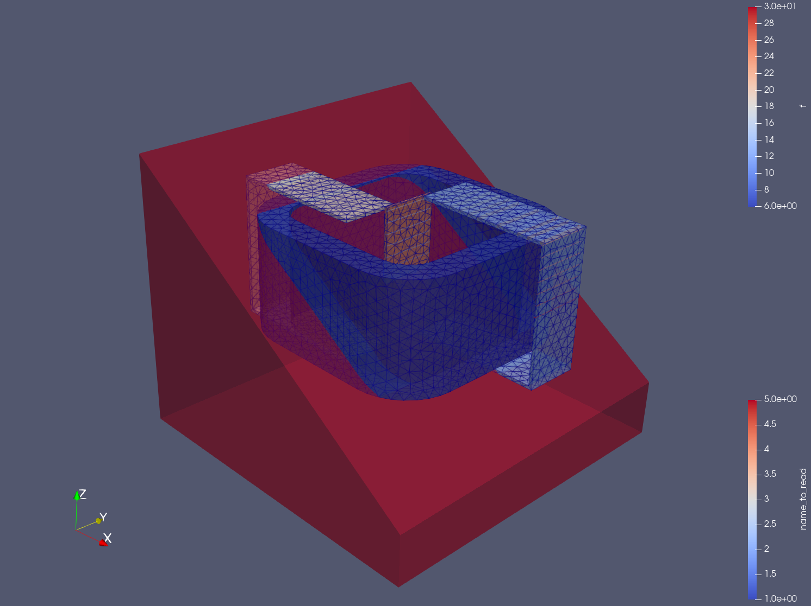

# CP1-Maxwell
Computational Physics 1 - Maxwell Project

If the fenics in docker container is used run
```
./fenics_docker_gmsh_workaround.sh
```

For requirements see requirements.txt

The image shows the files mesh_airbox_300_domains.pvd (Search coils) and mesh_airbox_300_tetra.pvd

